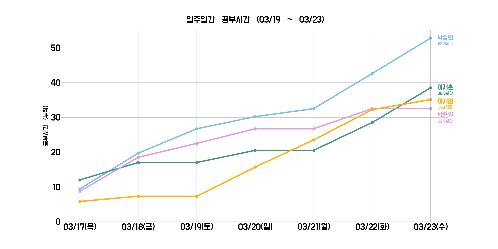

# 간단한 대쉬보드 만들기

자세한 구축 방법은 [블로그 글](https://wjdqlsdlsp.github.io/%EB%8D%B0%EC%9D%B4%ED%84%B0%EC%97%94%EC%A7%80%EB%8B%88%EC%96%B4/2022/03/06/%EA%B0%84%EB%8B%A8%ED%95%9C%EB%8C%80%EC%89%AC%EB%B3%B4%EB%93%9C/)을 참고해주세요 ! 

간단한 기능도는 위와 같습니다.

1. 노션을 이용해서, 사용자로부터 글을 입력받습니다
2. 노션 데이터베이스로 부터 CSV를 다운받습니다.
3. 다운로드 받은 CSV를 분석하여, 시각화를 진행합니다. ( 이 과정에서 matplotlib를 사용하여 시각화 했습니다. )
4. 시각화를 png형태로 저장하고, python boto3를 이용하여 AWS S3에 저장합니다.
5. S3주소를 통해 대쉬보드를 공유합니다.

 

## 결과물

 

## 업데이트 내용
1. 사용자에 입력에 따라 오류가 발생할 수 있으므로, 이를 처리하는 코드가 필요 ( 시간을 잘못 입력 하는 경우 등 )
2. 공부시간이 비슷할 경우 마지막 날에 나오는 글씨가 겹칠 수 있음, 이를 일정 간격을 조정하여 안겹치게 조정
3. 사용자의 요청으로 x축 날짜에 요일 추가
